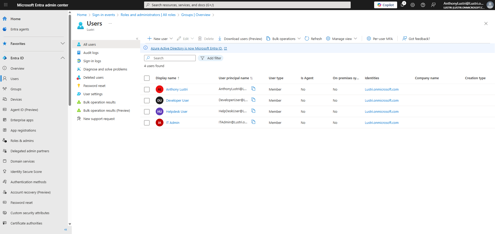
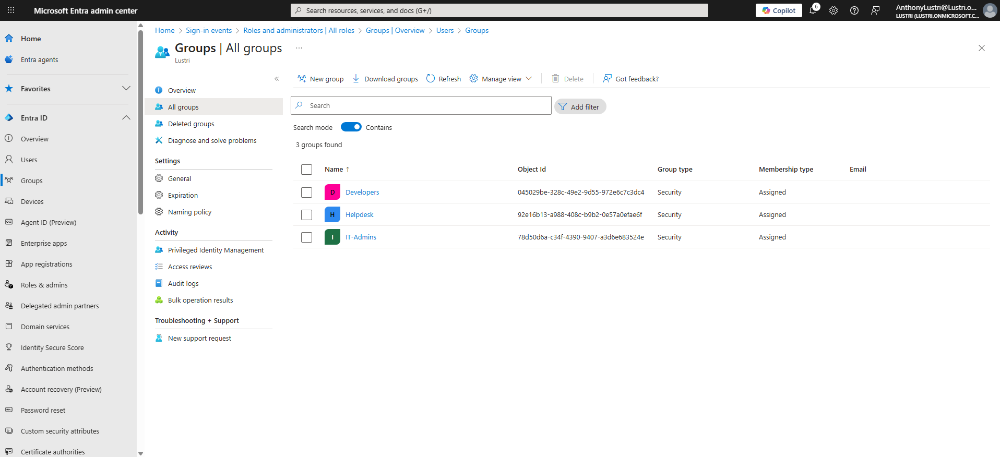
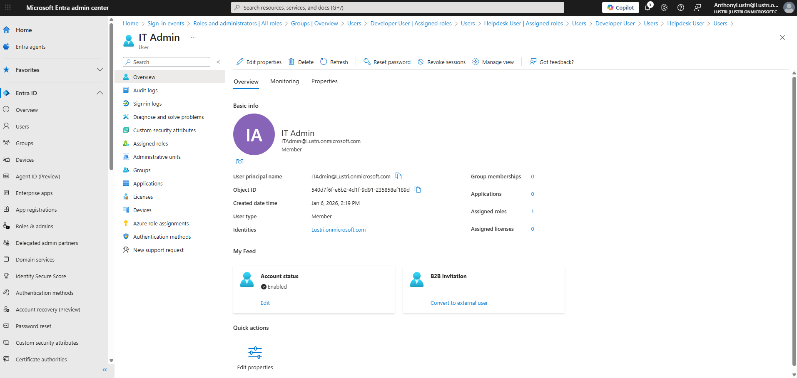
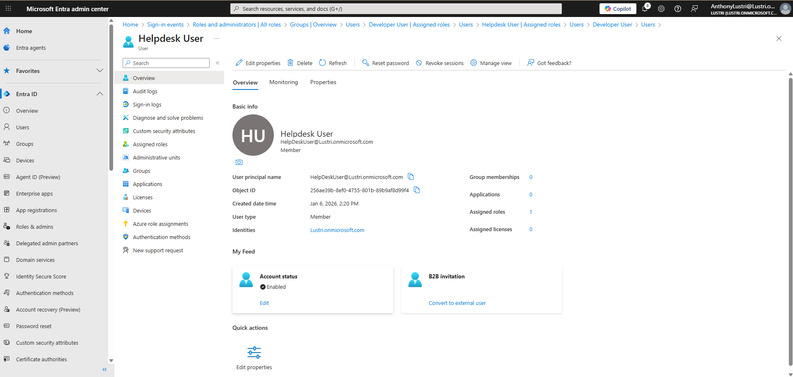
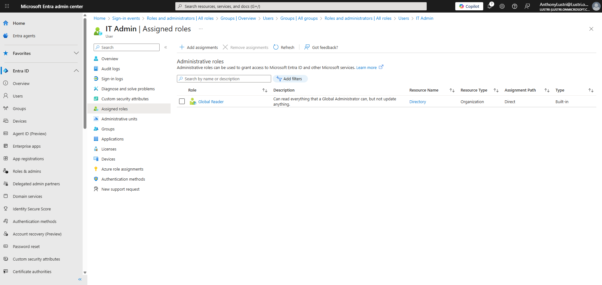
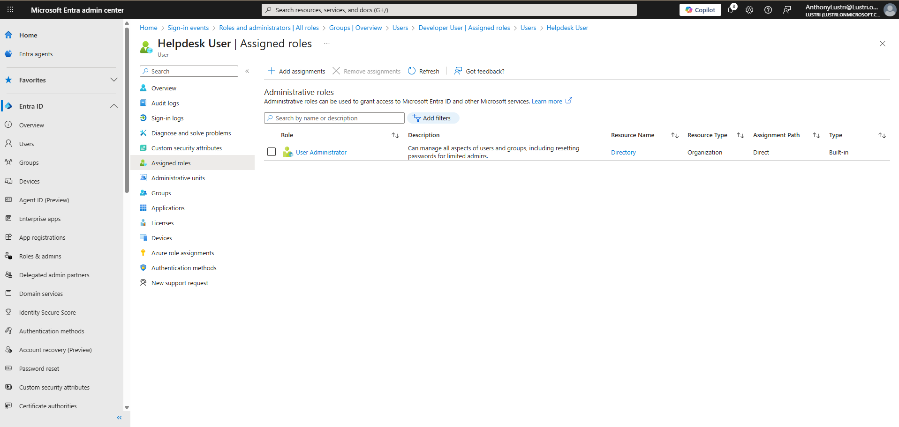
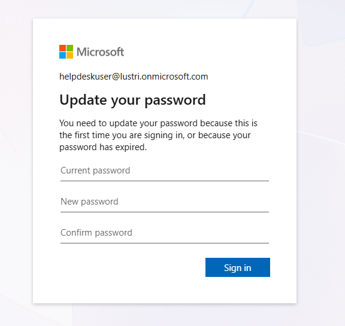
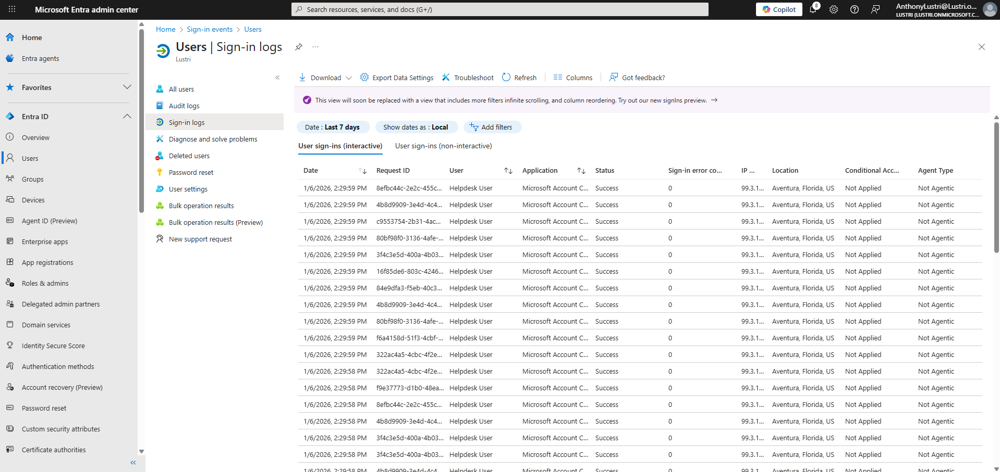
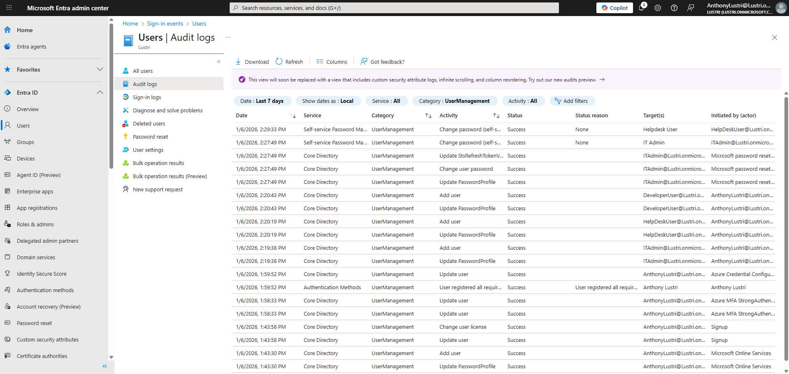

# Walkthrough – Azure Entra ID Identity & Access Lab

## Step 1: User Creation
Three users were created to represent common enterprise roles:
- IT Administrator
- Helpdesk User
- Developer User

---

## Step 2: Security Group Creation
Security groups were created for role-based access:
- IT-Admins
- Helpdesk
- Developers

All groups use assigned membership.

---

## Step 3: Group Membership
Users were added to the appropriate groups based on job role:
- IT Administrator → IT-Admins
- Helpdesk User → Helpdesk
- Developer User → Developers

  
  

---

## Step 4: Role-Based Access Control (RBAC)
Directory roles were assigned to groups:
- IT-Admins → Global Reader
- Helpdesk → User Administrator
- Developers → No directory role

Role inheritance was verified at the user level.

  

---

## Step 5: Authentication & Monitoring
Authentication activity was generated through user sign-ins, including first-time sign-in behavior.
Sign-in and audit logs were reviewed to confirm visibility into authentication and administrative actions.

  
  

